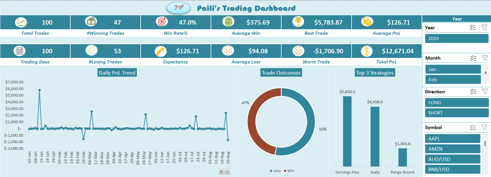

# trading-tracker-dashboard
A simple personal trade logging workbook built in Excel with an automated dashboard for tracking performance across Equities, Forex, and Crypto markets.

---

## Preview



---

## Folder Structure

```
trading-tracker/
├── trading_tracker.xlsx         # Clean version — ready for your own data
├── trading_tracker_sample.xlsx  # Sample version — pre-filled with demo trades
├── trading_dashboard.png                # Dashboard screenshot
├── README.md                    # You are here
└── LICENSE
```

---

## Features

- **Trade Log** — Log trades with entry/exit prices, position size, stop loss, take profit, strategy, and notes
- **Auto-calculated columns** — Win/Loss, PnL, Risk (R), RR Ratio, Trade Status, and date breakdowns (Day, Month, Quarter, Year) populate automatically from your inputs
- **Interactive Dashboard** — KPIs, charts, and pivot-based visuals update in real time as you log trades
- **Slicer filters** — Filter the dashboard by market, strategy, direction, and more

---

## Sheets

| Sheet | Purpose |
|---|---|
| `Trade Log` | Main input sheet — enter Date and PnL; all other columns are formula-driven |
| `Helper_Data` | Pivot data powering the dashboard charts and KPIs |
| `Dashboard` | Visual summary with KPIs, charts, and slicers |

---

## How to Use

1. Open `trading_tracker.xlsx` in Excel
2. In the **Trade Log** sheet, enter values in the input columns:
   - Date, Symbol, Market, Direction, Entry Price, Exit Price, Position Size, Stop Loss, Take Profit, Fees, PnL, Strategy, Notes
3. All other columns (Win/Loss, RR Ratio, Quarter, etc.) will populate automatically
4. Head to the **Dashboard** sheet to see your performance update in real time
5. Use the **slicers** to filter by market, strategy, or time period
6. After adding new data, right-click any pivot table → **Refresh** to update the dashboard

---

## Markets Tracked

- US Equities (SPY, NVDA, AAPL, TSLA, META, AMZN, etc.)
- Forex (EUR/USD, GBP/USD, USD/JPY, USD/CAD, AUD/USD)
- Crypto (BTC/USD, ETH/USD, SOL/USD, DOGE/USD, XRP/USD, BNB/USD)

---

## Strategies Logged

Momentum · Scalp · Swing · Trend Follow · Breakout · Support/Resistance · Mean Reversion · VWAP Fade · Range Bound · Earnings Play

---

## Requirements

- Microsoft Excel (2016 or later recommended)
- Pivot Table and Slicer support — **not compatible with Google Sheets**

---

## License

MIT License — feel free to use, modify, and share. See [`LICENSE`](LICENSE) for full terms.
